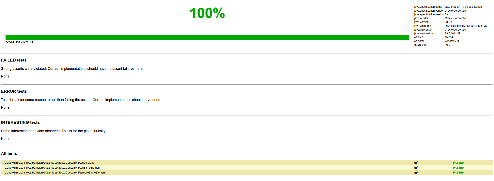
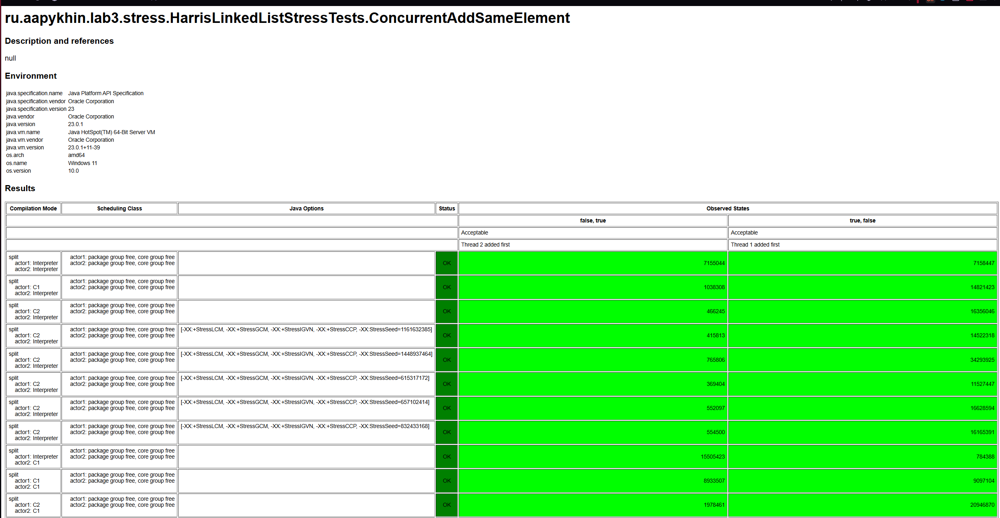
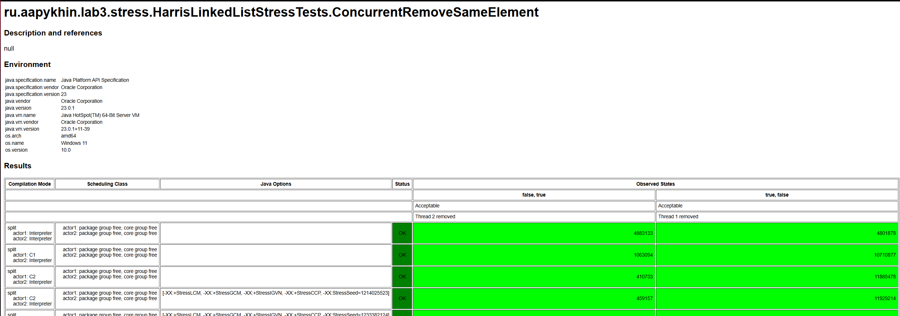
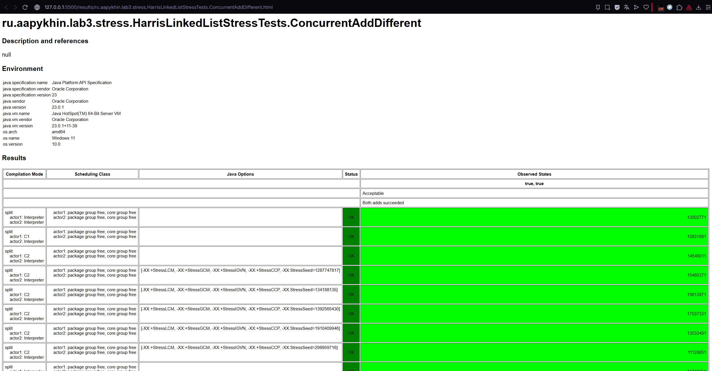
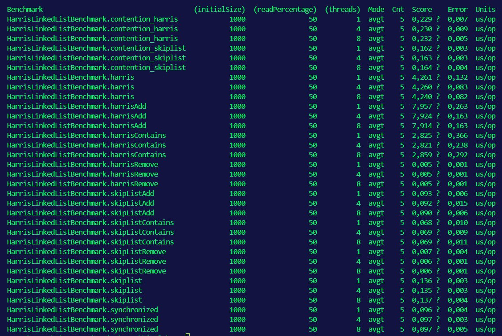

# Harris Lock-Free Linked List

Лабораторная работа №3: Разработка конкурентной структуры данных

## Описание

Реализация lock-free связного списка на основе алгоритма Harris с тестированием производительности (JMH) и корректности (JCStress).
#### Ключевые концепции

1. **Lock-free гарантия**: как минимум один поток всегда делает прогресс
2. **Логическое удаление (Logical Deletion)**: узел сначала маркируется как удалённый, затем физически удаляется
3. **Marked Pointers**: использование `AtomicMarkableReference` для хранения флага удаления в указателе
4. **CAS (Compare-And-Swap)**: все модификации выполняются атомарно через CAS-операции

### Гарантии

| Операция     | Гарантия  | Сложность |
|--------------|-----------|-----------|
| `add()`      | Lock-free | O(n)      |
| `remove()`   | Lock-free | O(n)      |
| `contains()` | Wait-free | O(n)      |

## Структура проекта

```
src/
├── main/java/ru/aapykhin/lab3/list/
│   └── HarrisLinkedList.java      # Основная реализация
├── test/java/ru/aapykhin/lab3/list/
│   └── HarrisLinkedListTest.java  # JUnit тесты
├── jmh/java/ru/aapykhin/lab3/benchmark/
│   └── HarrisLinkedListBenchmark.java  # JMH бенчмарки
└── jcstress/java/ru/aapykhin/lab3/stress/
    └── HarrisLinkedListStressTests.java  # JCStress тесты
```

## Тестируемые сценарии

### JMH Бенчмарки

1. **Сравнение с альтернативами:**
   - Harris Lock-Free List
   - ConcurrentSkipListSet (JDK)
   - Collections.synchronizedSet (baseline)

2. **Параметры:**
   - Количество потоков: 1, 2, 4, 8, 16
   - Начальный размер: 1000, 10000
   - Соотношение чтения: 50%, 90%

3. **Сценарии:**
   - Чистые операции (add, remove, contains)
   - Смешанные операции
   - Высокая конкуренция

## Результаты тестирования

### JCStress — тесты корректности многопоточности

Все тесты пройдены успешно (100%):



#### Тест 1: ConcurrentAddSameElement

**Что проверяет:** Два потока одновременно пытаются добавить один и тот же элемент в пустой список.



#### Тест 2: ConcurrentRemoveSameElement

**Что проверяет:** Два потока одновременно пытаются удалить один и тот же элемент из списка.



#### Тест 3: ConcurrentAddDifferent

**Что проверяет:** Два потока одновременно добавляют разные элементы (1 и 2) в пустой список.



### JMH — бенчмарки производительности

Сравнение производительности Harris Lock-Free List с ConcurrentSkipListSet и synchronized TreeSet:



**Выводы:**
- Harris List медленнее из-за сложности O(n) против O(log n) у SkipList
- При высокой конкуренции (contention) разница минимальна
- Lock-free не означает "быстрее" — это гарантия прогресса, а не скорости

## Известные ограничения

1. **Сложность O(n)** — список не оптимизирован для поиска (в отличие от Skip List)
2. **Нет итератора** — итерация в lock-free структурах сложна для реализации корректно
3. **size() не атомарна** — может быть неточной при конкурентных модификациях
4. **Memory reclamation** — нет явного механизма освобождения памяти удалённых узлов (полагаемся на GC)

## Литература

1. Harris, T. L. (2001). "A Pragmatic Implementation of Non-Blocking Linked-Lists"
